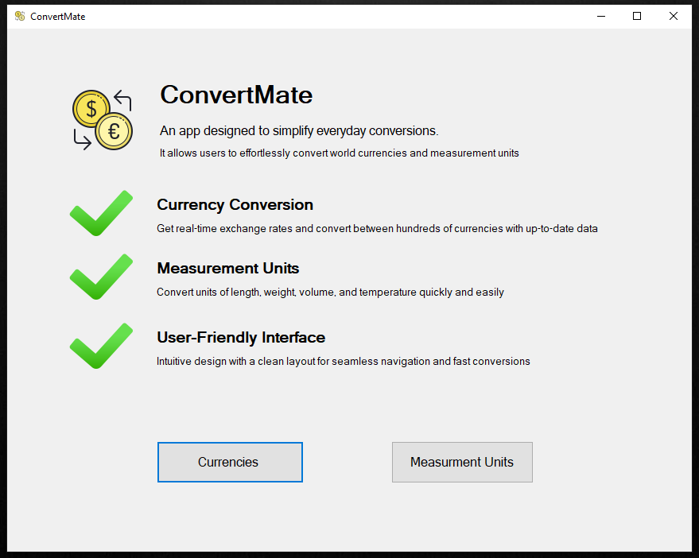
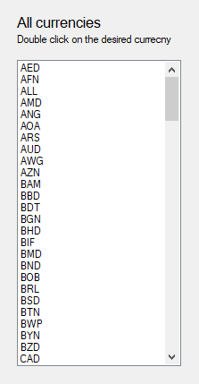
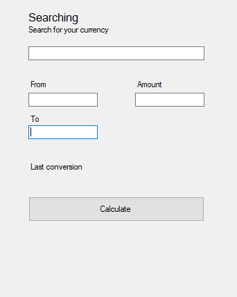
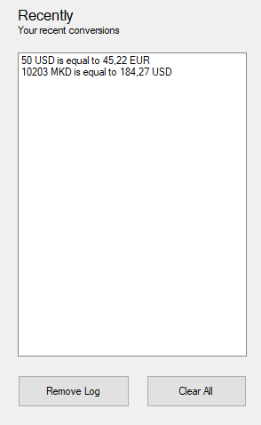
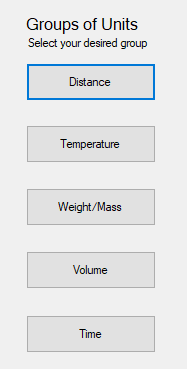
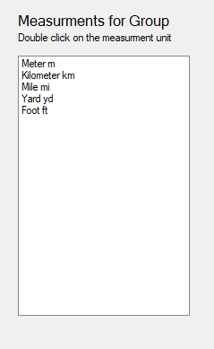
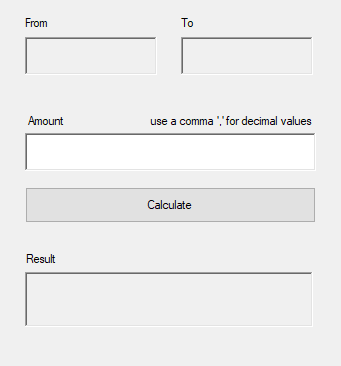

### ConvertMate
ConvertMate е десктоп апликација која главно се користи за конверзија на светско познати парични валути
и други мерни групи како на пример за растојание, температура, волумен ...

Поточно кажано има 5 мерни групи, а тие се:
- Растојание
- Температура
- Волумен
- Маса
- Време

### Упатство за користење

При уклучување на програмата, се наоѓаме на почетната страна каде што имаме 2 опции:
- Да конвертираме парични валути
- Да конвертираме мерни единици

### Конвертирање на парични валути

Кога ќе ја отвориме оваа форма, најлево може да забележиме листа на валути
кои се вчитуваат во краток период, доколку се е исправно.

Овие валути се сите валути кои може да се конвертираат од една во друга кои ги нуди програмата.

Со двоен клик на една од валутите се префлува во 'from' полето, а потоа со двоен клик повторно на една
од валутите се префлува во 'to' полето.

И овај циклус се повторува со секое наредно двојно кликнување.

Наредно се внесува количината на одредената валута што сакаме да ја конвертираме.
И за крај стискаме на копчето 'calculate', чекаме малку и резултатот ќе го забележиме над копчето.

Ова чекање се случува поради тоа што правиме барање до одреден сервер (API) да ја искалкулира конверзијата и да ни го врати резултатот.

На десната страна може да забележиме уште една листа која на почеток е празна, но со секоја конверзија се пополнува.
Листата е всушност листа на направени конверзии.

Под неа има две копчиња кои се користат за бришење на досегашните конверзии, едното едно по едно, другото сите истовремено.

Исто така може да забележиме едно поле за внес кое се користи за пребарување на посакуваната валута.

### Конвертирање на мерни единици

При стартување на оваа форма може да забележиме
5 копчиња на левата страна кои соодветно претставуваат мерни групи.

Со клик на едно од овие копчиња се пополнува листата на мерни едници за одредената мерна група.

Слично како и кај конверзијата на валути, така и овде со двоен клик на една од мерните единици
се внесува во 'form' полето, а со повторно двоен клик се внесува во 'to' полето.
Исто и овде овај циклус продолжува со секој нареден двоен клик.

Можиме да забележиме дека калкулирањето на конверзиите само кај мерната група
за ДИСТАНЦА се чека малку време.
Тоа е поради фактот што и овде за конверзија се користи API, но само за оваа мерна група.

Затоа и овде БИТНА ни е стабилна мрежна конекција.

Исто така на двете форми може да забележиме статус на мрежна конекција, која е БИТНА за исправна функционланост на програмата.
